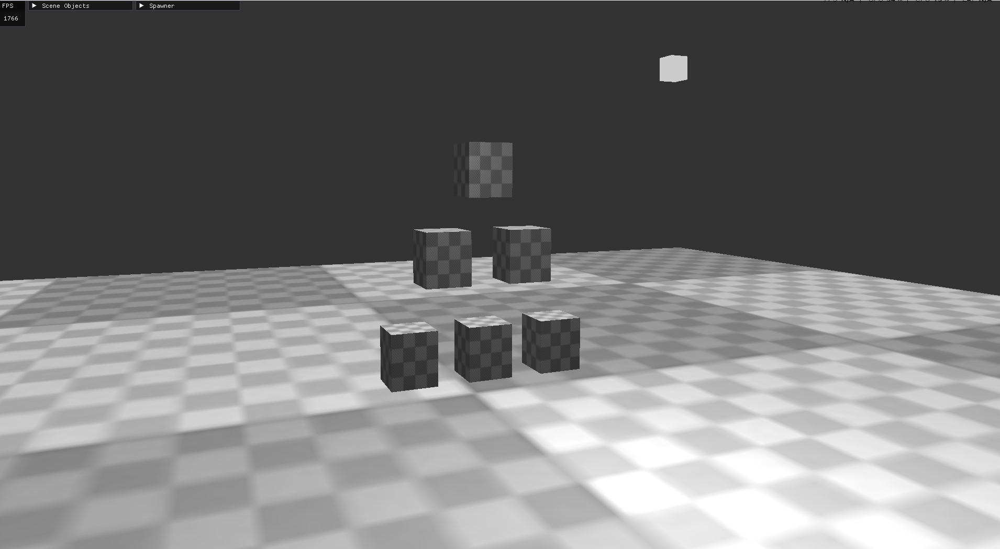
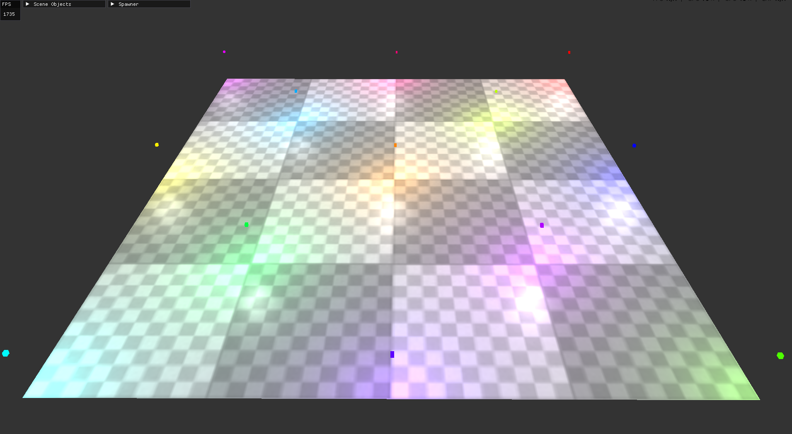

# Basic Engine

A minimal C++/OpenGL demo showcasing a simple rendering pipeline.

## Features

### Implemented
- Camera movement
- Cube and Plane primitives
- Basic lighting
- ImGui UI
- Uses GLFW, GLAD, GLM, and stb_image (all bundled)

### Planned
- More primitive types
- Texture selection
- Model loading
- Collision
- Advanced lighting techniques

## Screenshots
 





## Build

```sh
mkdir build && cd build
cmake ..
cmake --build .
```

Run the executable (`build/PrimitiveShowcase` on Unix, `build.exe` on Windows).

No external dependencies. Everything is in the repo.

---

### Notes

If you just want to look at the code or see the visuals, building is optional.
There is a demo video in the readme_asset directory. 

